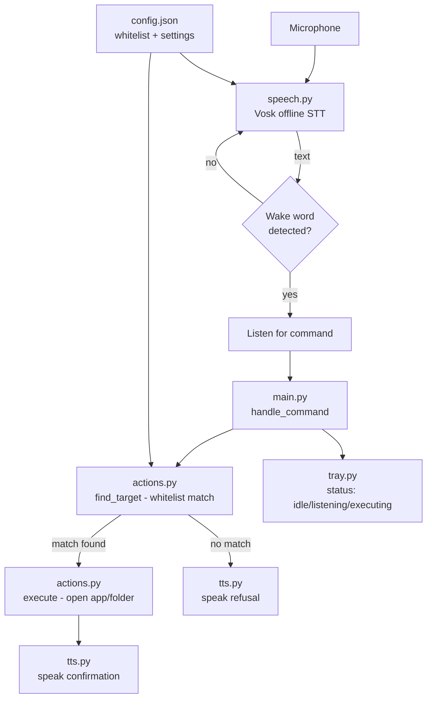

# Project Nova — Personal Desktop Voice Agent
### Project Plan & Roadmap

**Owner:** Amir
**Role:** Solo developer (guided)
**Status:** v1 (MVP) delivered — planning document written retroactively per request, to govern v2 onward

---

## 1. Problem Statement & Vision

Amir wants a personal, Jarvis-style AI agent that lives on his Windows laptop: it launches on boot, listens for voice commands, and can open apps/files/folders on request. Long-term vision includes broader "improvisation" — open-ended requests handled by reasoning, not just fixed commands — and possibly full screen/computer control.

The core tension to manage throughout this project: **capability vs. blast radius.** Every feature that makes Nova more useful (broader app access, an LLM brain, screen control) also increases what could go wrong if it misfires, mishears, or is misused. The plan below is sequenced specifically so trust is built incrementally, not granted all at once.

## 2. MVP Definition (what "done" means for v1)

MVP = the smallest version that proves the core loop end-to-end and is genuinely usable daily.

**In scope for MVP (delivered):**
- Wake-word activation ("hey nova"), fully offline
- Voice → text via local speech recognition (no cloud, no API key)
- Text → voice replies (local TTS)
- Whitelisted "open X" commands only (apps + folders), no arbitrary execution
- Visible status indicator (tray icon: idle / listening / executing)
- Manual, reversible launch-on-boot setup

**Explicitly out of scope for MVP** (deferred by design, not oversight):
- Any cloud/LLM reasoning
- Screen or mouse/keyboard control
- File editing, deletion, or content generation
- Multi-turn conversation / context memory
- Any command not pre-approved in `config.json`

**MVP success criteria:**
1. Nova launches without crashing and shows "idle" in the tray.
2. Saying "hey nova" reliably triggers listening (tested ≥10 attempts, target ≥8/10 detection).
3. A whitelisted "open chrome" command opens Chrome within ~2 seconds of the command finishing.
4. A non-whitelisted request is refused verbally, not silently ignored and not guessed at.
5. Nova can be fully removed (stop process + delete Startup shortcut) with zero residual system changes.

## 3. Architecture Overview

Design principle reflected in this diagram: **every path that results in an action passes through the whitelist check (`find_target`)** — there is no branch from voice input directly to system execution.

## 4. Tech Stack & Rationale

| Component | Choice | Why |
|---|---|---|
| Language | Python 3.10+ | Fastest path to working code, huge ecosystem for STT/TTS/system control, easy for you to read and modify |
| Speech-to-text | Vosk (offline) | No API key, no cost, no internet dependency, audio never leaves the machine — matches the security posture we agreed on |
| Text-to-speech | pyttsx3 (wraps Windows SAPI5) | Offline, built into Windows, zero setup |
| App/folder launching | `subprocess` / `os.startfile` | Standard library, no extra risk surface |
| Status display | pystray (tray icon) | Lightweight, no separate GUI framework needed for v1 |
| Config | Plain JSON, hand-edited | Transparent, version-controllable, no hidden state — you always know exactly what Nova can touch |

## 5. Roadmap (Phased)

**Phase 0 — MVP (complete)**
Wake word, offline STT/TTS, whitelist-only app/folder opening, tray status. *(This is what was delivered and is pending your real-machine test.)*

**Phase 1 — Harden & Expand Commands** *(next, after Phase 0 is verified working on your machine)*
- Add "close X" (terminate a whitelisted running process)
- Add basic media/volume control
- Add a real transcript log window (not just tray tooltip)
- Add automated tests for anything not hardware-dependent (following the pattern of `test_actions_logic.py`)
- Exit criteria: you've used it daily for a week with no unwanted actions triggered

**Phase 2 — Reasoning Layer (optional LLM brain)**
- Wire in an LLM (e.g. Claude API) for open-ended requests that don't match a fixed command
- Critical design decision to make explicitly at this phase: does the LLM get to call `execute()` directly, or does it only ever suggest and a human/whitelist gate still approves? Recommendation: keep the whitelist gate — let the LLM interpret intent, not bypass the boundary.
- Exit criteria: you've explicitly decided and documented the new data-flow (what leaves the machine, what doesn't)

**Phase 3 — Broader System Access**
- File search/read (read-only first, before any write/delete capability)
- Possibly integrate an existing computer-use framework (e.g. Open Interpreter's OS mode) rather than building screen/mouse control from scratch
- Exit criteria: a written risk review before this phase starts — this is the biggest capability jump in the project

**Phase 4 — Polish**
- Proper GUI instead of tray-only
- Packaging as a standalone installer instead of "run from source"
- Multi-device / settings sync if wanted

## 6. Risk Register

| Risk | Likelihood | Impact | Mitigation |
|---|---|---|---|
| Misheard command triggers wrong app | Medium | Low (whitelist-bounded) | Whitelist keeps blast radius small; fuzzy-match cutoff tuned conservatively |
| Wake word false-triggers from TV/conversation | Medium | Low | Hotkey fallback available if this proves annoying in practice |
| Future LLM phase leaks data or over-acts | Low (not yet built) | High | Explicit gate design required before Phase 2 ships (see above) |
| Screen-control phase causes unintended clicks | Low (not yet built) | High | Deferred to Phase 3, evaluate existing hardened tools first |
| Dependency install friction (mic drivers, build tools) | Medium | Low | README documents the known Windows/Python C++ build tools issue |
| `download_file` (first write capability, added post-Phase-3) fetches something malicious or oversized | Low | Medium | http/https-only, executable/script extension denylist, 50MB cap enforced during streaming (not just trusted headers), sanitized filenames, writes confined to an already-whitelisted folder, never overwrites an existing file — see `CLAUDE.md`'s Architecture section for the full breakdown |

## 7. Immediate Next Steps (for you)

1. Follow `README.md` to install and run Nova v1 on your laptop.
2. Report back: did it launch, did wake-word detection work, did "open chrome" work.
3. Once Phase 0's success criteria (Section 2) are met, we move to Phase 1 together.
